# Lanternmoss

A tiny cozy planet of lanterns, moss and friendly critters: a third-person browser game built with
[Three.js](https://threejs.org/) (r160) and plain ES modules, with no asset files (every model, icon and sound is made in
code). Pick the Girl Witch, the Boy Warrior or the Elf Archer, explore a little round planet, help the villagers, open
treasure chests, gear up, raise a pet, and fight the monsters beyond the village lanterns.

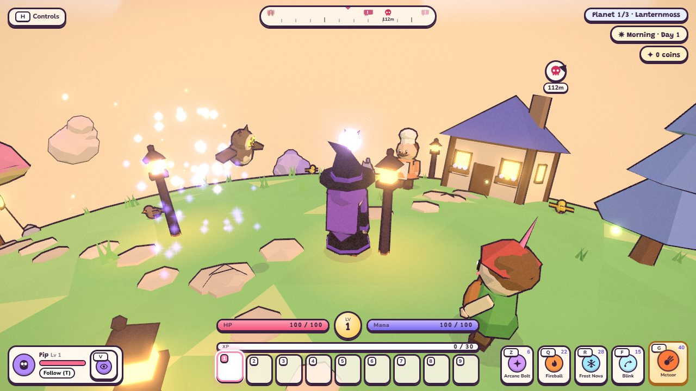

**Campaign:** every planet has a boss in a lair on its far side, marked by a shaft of light. Defeat it, open the treasure
chest it leaves, and the hero travels on to the next, harder planet (Lanternmoss, then Emberfall, then Frostveil),
keeping their level, gear, bag, coins and pets. Each boss is its own fight: Gloomcap the Moss King, Pyrrhax the red
dragon, and Malgrath, the two-phase Winged Demon Lord.

## A tour of the game

*Screenshots of the current version (retaken after every major update: see [Refreshing the screenshots](#refreshing-the-screenshots)).*

<p>
  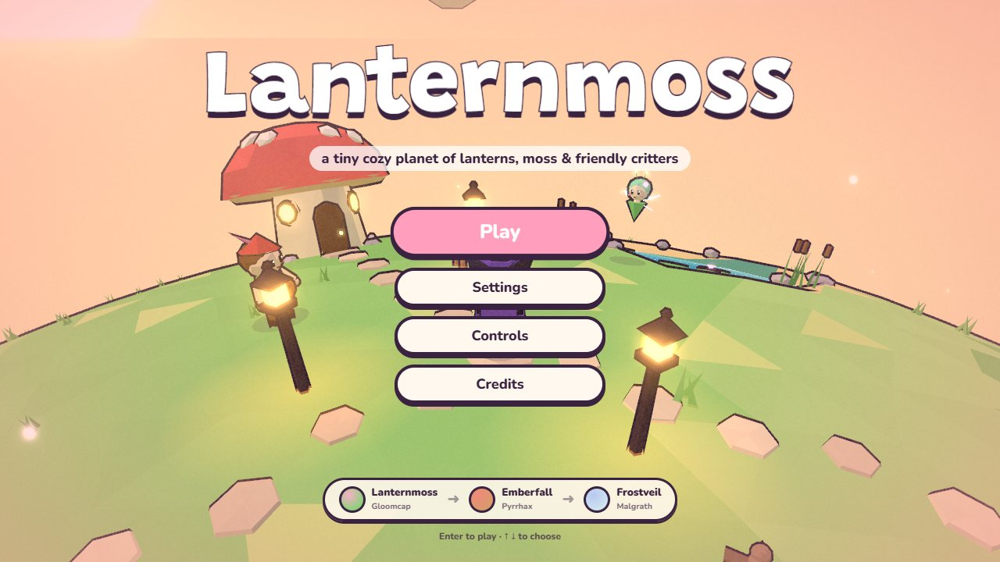
  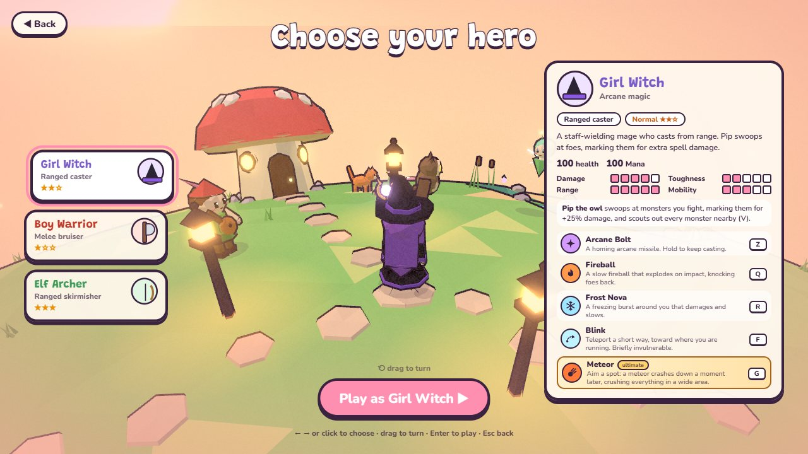
</p>

**Three heroes.** The title screen shows the campaign ahead; the hero select compares the Girl Witch (arcane spells),
the Boy Warrior (a two-handed axe and a guard) and the Elf Archer (a longbow), with every ability, its keys and a
rating chart. Each hero has four abilities plus an aimed ultimate (Meteor, Leap Slam, Arrow Rain).

<p>
  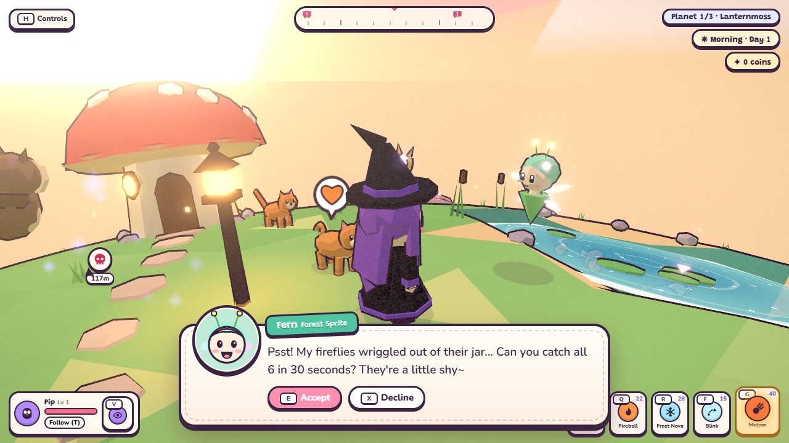
  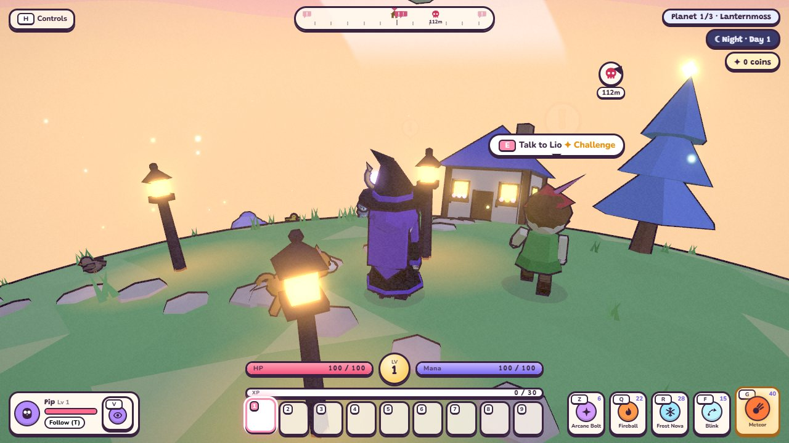
</p>

**A living village.** Villagers keep a daily schedule on a day / night clock, sleep at night (some go home to bed),
remember your adventure, talk with portraits and expressions, and hand out mini-challenges and multi-step quests.
Pim runs the bakery shop by day; each later planet has a local of its own.

<p>
  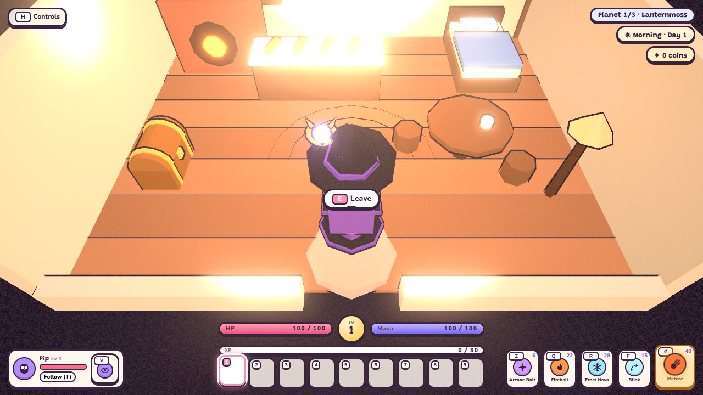
  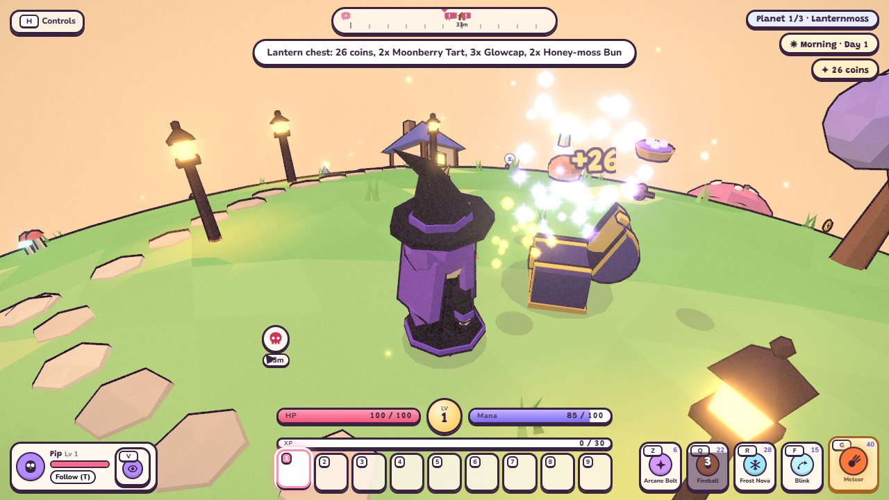
</p>

**Houses and treasure.** Walk into the village houses: furniture to use (a bed to nap or sleep till morning, chests,
bookshelves with lore, a kettle, an oven), and the people who live there. Out in the wilds, Mossy chests, locked
Lantern chests (find a Lantern Key) and a boss treasure chest after every boss.

<p>
  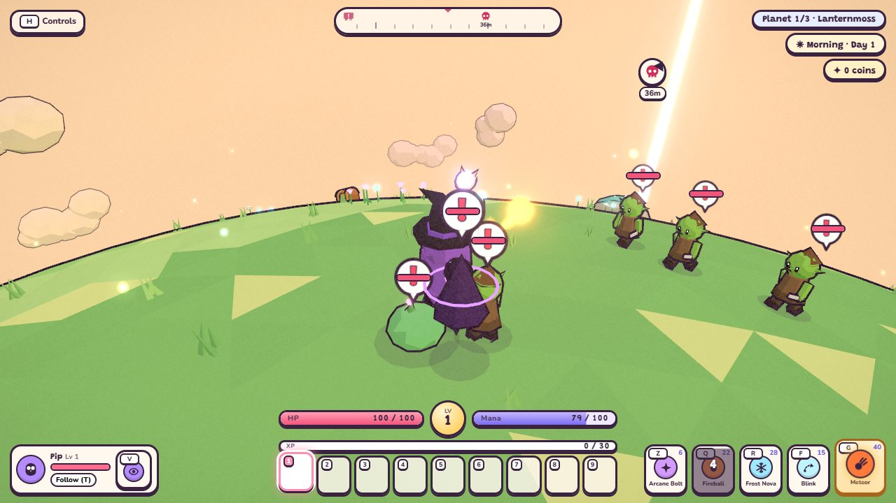
  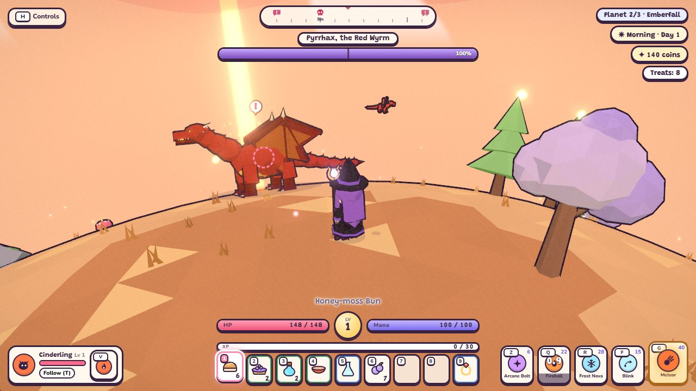
</p>

**Combat.** Soft lock-on, quick abilities with cooldowns and a resource bar, aimed ultimates, damage numbers and
hit-stop. Monsters range from goblin packs and charging ramhorns to burrowing thornmoles and shielding hexlanterns,
and every boss has telegraphed attacks to read and dodge.

<p>
  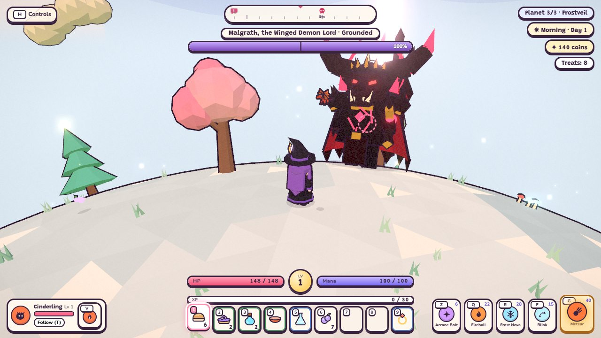
  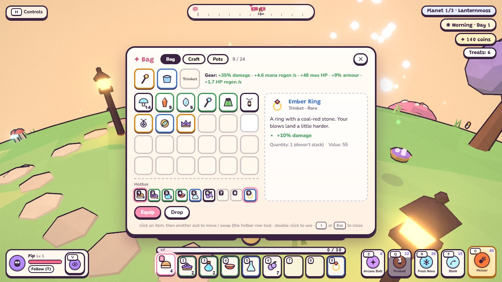
</p>

**Gear.** Weapons, armour and trinkets with stat bonuses, each piece with its own rolled rarity (Common to Legendary)
that scales its stats. Monsters drop food, materials and gear. Food, tonics and gear land on the hotbar (`1`–`9`) at the
bottom of the screen: hold one, then use it (eat, drink or equip) mid-fight.

<p>
  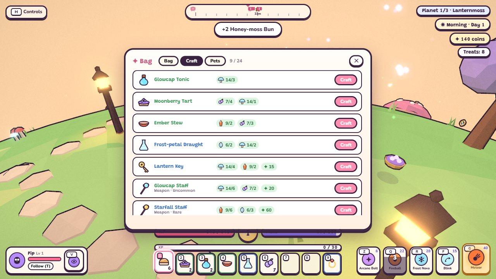
  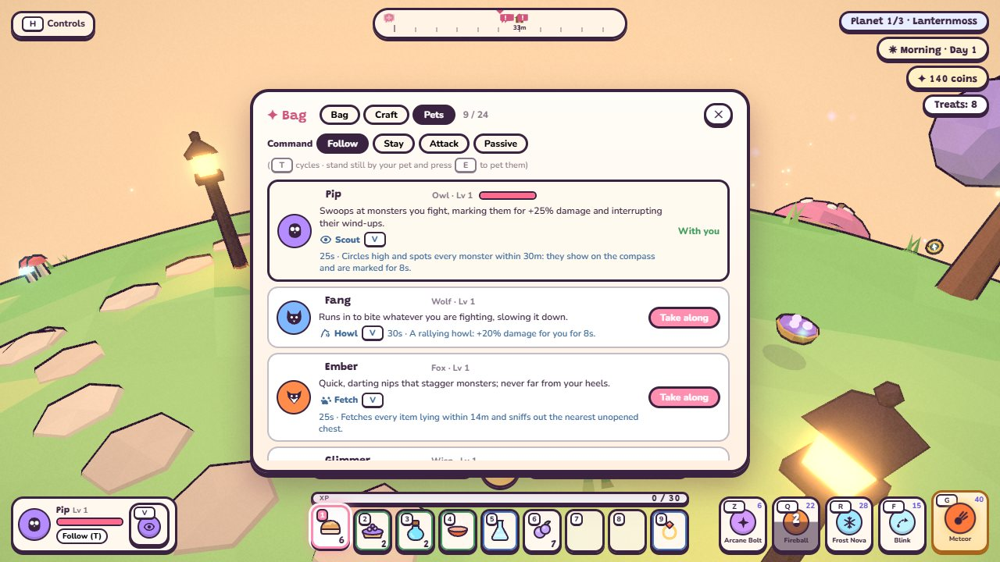
</p>

**Crafting and pets.** Glowcaps, Ember Shards and Frost Petals craft into tonics, keys and gear. Pets fight beside you,
grow with you, take commands (follow, stay, attack, passive), have an ability of their own, can be renamed and petted,
and new ones are found through quests and chests: an owl, a wolf, a fox, a wisp and a dragon whelp.

<p>
  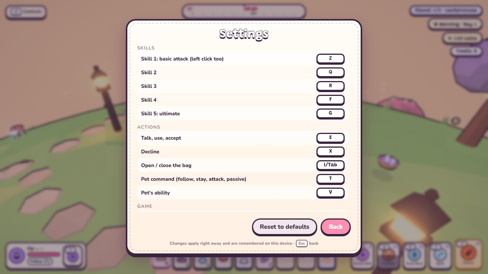
  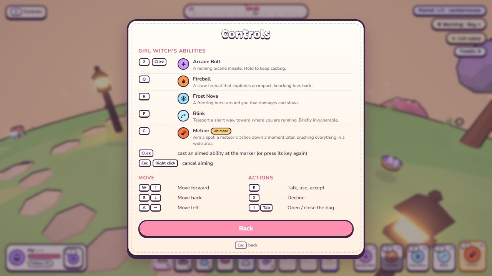
</p>

**Your keys.** The HUD keeps the hotbar and vitals at the bottom centre, skills on the lower right and your pet on the
lower left. Every action can be remapped in Settings → Keys, and every key hint in the game follows your bindings.

## What's new

Major updates, newest first (the full list with notes is in [TODO.md](TODO.md)):

- **A new HUD:** a Minecraft-style hotbar on `1`–`9` with vitals above it, skills on the lower right on letter keys,
  every key remappable, and new type chosen for the game's storybook feel ([docs/typography.md](docs/typography.md)).
- **Pets:** five pets with commands, abilities, levels, health and fainting, naming and petting; any hero, any pet.
- **Better items:** equipment slots, rarity-scaled gear, monster drops, crafting, per-item art, quick-use keys.
- **Treasure chests:** loot tables, locked chests and keys, a boss chest that holds the trophy.
- **Enterable houses:** interiors with furniture to use, residents, and villagers asleep in their beds.
- **Livelier villagers:** day / night schedules, story-aware dialogue with portraits, quests, coins and a shop.
- **Character select, title screen, pause menu and settings, and a new HUD** (bars, ability tooltips, boss bar, compass).
- **Boss overhaul:** Pyrrhax the dragon and Malgrath the two-phase Demon Lord, aimed ultimates, quicker dodges.

## Running

ES modules can't be loaded from `file://`, so the game needs a local web server:

```sh
npm start            # zero-dependency static server -> http://localhost:8080/
npm start -- 3000    # or pick a port
```

Any static server works too (`npx serve`, `python -m http.server`). An internet connection is needed: Three.js and the
UI font come from CDNs, declared in the import map in `index.html`.

```sh
npm test             # unit tests (Node's built-in test runner, no dependencies)
```

### Refreshing the screenshots

The pictures above live in `docs/screenshots/` and are retaken after every major update by playing staged scenes in
headless Chrome (a few minutes with software rendering):

```sh
npm i --no-save puppeteer-core     # once; not a project dependency
node scripts/screenshots.mjs       # all shots, or e.g. `node scripts/screenshots.mjs bag,pets` for some
```

`CHROME` points it at another browser, `PUPPETEER` at an existing puppeteer-core install. A new feature worth showing
gets a scene in `scripts/screenshots.mjs` and a spot in the tour above.

### Controls

Every key except the number row and `Esc` can be remapped in **Settings → Keys** (a key that's already in use swaps
over). The defaults:

| Key | Action |
|---|---|
| `W A S D` / arrows | move (camera-relative) |
| `Shift` | sprint |
| `Space` | jump (hold for a floatier rise) |
| click / `Z` | skill 1: the basic attack (hold to repeat) |
| `Q` `R` `F` | skills 2–4 |
| `G` | skill 5, the ultimate: a marker follows the cursor; click (or `G` again) to cast there, `Esc` / right click cancels |
| `1` – `9` | hold the item in that hotbar slot (or click it); press the number again, or right click, to use it |
| `E` / `X` | talk, use, advance, accept / decline (and `E` beside your pet, standing still, pets them) |
| `I` or `Tab` (`Esc` closes) | open / close the bag (Bag, Craft and Pets tabs) |
| `T` | pet command: follow → stay → attack my target → passive |
| `V` | your pet's ability (Scout, Howl, Fetch, Mend or Flame Burst) |
| drag / wheel | rotate / zoom camera |
| `Esc` / `P` | pause menu: resume, settings, controls, quit (Esc first closes the bag, aiming or dialogue) |
| `H` | show / hide the controls panel (it folds away by itself after a while) |
| `M` | mute |
| `C` (twice) | back to character select (restarts the adventure) |

## Project structure

```text
index.html                 markup only: HUD, dialogue box, challenge panel, character-select overlay
styles/main.css            all styling
scripts/serve.mjs          zero-dependency dev server
scripts/screenshots.mjs    retakes the README screenshots (headless Chrome)
docs/screenshots/          the README screenshots
docs/typography.md         the type brief, the pairings compared (type-specimen.html) and the choice
tests/                     unit tests: XP / level math, inventory, planets + enemy scaling, combat + boss config, settings,
                           heroes, villagers + quests + shop, houses, chests + loot, items + gear + crafting, pets, keybinds
src/
├── main.js                entry point: builds the Game, starts the loop, exposes window.LANTERNMOSS
├── errorOverlay.js        classic script that shows load/runtime errors on screen
├── config/                every tunable number and authored data table (no logic, no Three.js)
│   ├── game.js            planet radius, world seed, movement, buff multipliers, camera
│   ├── render.js          pixel ratio, fog, bloom, outline width
│   ├── combat.js          spells, enemy and boss stats, boss attacks and phases, XP per enemy, pet marks
│   ├── pets.js            every pet: body, attack, ability, unlock; pet growth, care, commands, keys, motion
│   ├── planets.js         the campaign: each planet's seed, colours, difficulty scale, roster, boss, forage
│   ├── items.js           item definitions (incl. gear), categories, rarities and their stat multipliers, gear slots and
│   │                      stats, the hotbar, effects, bag size and pickup settings
│   ├── crafting.js        crafting recipes (materials + coins -> food, tonics, keys, gear)
│   ├── characters.js      the three playable heroes (stats, abilities, texts, ability tooltips, selection profile)
│   ├── settings.js        player settings schema (drives the Settings screen, defaults and validation)
│   ├── controls.js        every key: the remappable KEYBINDS (defaults), hotbar keys, fixed controls, key-cap labels
│   ├── credits.js         the Credits page text
│   ├── day.js             the village clock: day length, phases, light per phase
│   ├── shop.js            coins per monster, the shop's keeper, hours, stock and prices
│   ├── houses.js          enterable houses per planet: layout, furniture, owner / resident, note, chest gift
│   ├── chests.js          treasure chests and drops: kinds, loot tables, gear rarity odds, monster drops, keys, boss chest
│   ├── quests.js          multi-step villager quests (steps, rewards, dialogue)
│   ├── challenges.js      villager mini-challenges and their dialogue
│   ├── leveling.js        XP curve, level cap, stat and damage growth
│   └── critters.js        ambient animal looks
├── core/
│   ├── Game.js            startup order, per-frame update order, run lifecycle (begin / reset)
│   ├── GameLoop.js        requestAnimationFrame loop with a clamped timestep
│   ├── context.js         the shared live state (time, player, enemies, NPCs, paused...)
│   ├── settings.js        live player settings: validated, saved to localStorage, change listeners
│   ├── keybinds.js        live key bindings: is / held / labels, remapping with swaps, saved to localStorage
│   ├── events.js          game-wide events (quest completed, chest opened) other systems react to
│   └── controls.js        key bindings: what each input does
├── systems/               engine-level services
│   ├── RenderSystem.js    WebGL renderer, bloom + storybook post-processing, resize
│   ├── CameraSystem.js    third-person, surface-aligned, collision-aware camera rig
│   ├── InputSystem.js     keyboard state and mouse gestures (devices only, no game rules)
│   └── AudioSystem.js     procedural WebAudio music and sound effects
├── render/                Three.js building blocks
│   ├── scene.js           the scene and camera
│   ├── materials.js       toon ramp, glow, inverted-hull outline, point-sprite materials
│   ├── meshes.js          primitive geometries and outlined model parts
│   └── Batcher.js         merges static scenery into a few draw calls
├── physics/
│   ├── colliders.js       static, moving and camera colliders; overlap resolution
│   └── Walker.js          surface movement under spherical gravity (base class for every walker)
├── world/                 the planet (generated once, in a fixed order, from a seeded RNG)
│   ├── World.js           generation order, landmarks, per-frame sun / sky / ambient animation
│   ├── terrain.js         height function, ponds, ground-placement matrices
│   ├── placement.js       free-spot searches for scenery and spawns
│   ├── planet.js          the planet mesh
│   ├── props.js           prop builders (houses, trees, rocks, lanterns, flowers...)
│   ├── village.js         houses, standing-stone circle, lantern paths
│   ├── interiors.js       house interiors: room shells and furniture, built away from the planet
│   ├── scatter.js         pond decoration, trees, rocks, flowers, grass
│   ├── water.js           pond water shader
│   └── sky.js             sky dome, clouds, fireflies
├── models/                procedural character and item art (swap a builder to use real assets)
│   ├── humanoid.js  heroes.js  creatures.js  villagers.js (incl. planet locals and outfits)  monsters.js
│   ├── chest.js           treasure chest (hinged lid, padlock, light beam)
│   ├── bosses.js          demon lords (Gloomcap; Malgrath with greatsword + wings) and the shared bat wing
│   └── dragon.js          Pyrrhax, the red dragon
├── items/                 ItemRegistry (validated item catalogue), itemActions (what each category does),
│                          gear (rarity -> stats, totals, caps) and crafting (recipe rules); all pure
├── inventory/             Inventory: slot storage, stacking, capacity, moving / swapping, events (pure)
├── entities/              things that live and move in the world
│   ├── player/            Player (movement, model swap, placement) and pose animation
│   ├── enemies/           Enemy (melee / ranged / hopper AI), shared AI states, and behaviors/ for the newer AIs:
│   │                      bomber, charger, burrower, support, and boss/: the boss framework (core.js) with one kit
│   │                      per boss (gloomcap.js, dragon.js, demonLord.js)
│   ├── companions/        pet bodies: FlyingPet (owl, wisp, dragon whelp), WalkingPet (wolf, fox), petBrain (targets, hits)
│   ├── npc/               NPC behaviour (schedules, sleep, lines, outfits) and the villager definitions
│   │                      (places, schedules, story-aware dialogue, a local villager per later planet)
│   ├── wildlife/          critters, birds, pond fish and their spawning
│   ├── Projectile.js      surface-hugging projectiles
│   ├── Chest.js           a treasure chest in the world: collider, falling in, opening, rattling when locked
│   └── WorldItem.js       an item stack lying on the ground (can hop out of a chest)
├── combat/
│   ├── CombatSystem.js    per-frame combat update order
│   ├── casting.js         cooldowns, input buffering, hold-to-repeat, ability dispatch
│   ├── abilities/         witch spells, knight (axe warrior) moves, ranger (elf archer) shots, and ultimates.js
│   ├── aiming.js          aim mode for ground-targeted abilities (cursor -> ground marker, validity, confirm / cancel)
│   ├── area.js            area queries: who is inside a circle, landable spots, cursor -> ground ray
│   ├── hazards.js         timed area effects for both sides: Blast (marked, then detonates) and Zone (ticks over time)
│   ├── damage.js          damage both ways, fainting, respawning, regeneration
│   ├── enemyDefs.js       per-planet enemy stats (base stats x the planet's difficulty scale)
│   ├── events.js          encounter events ('bossdefeated')
│   ├── targeting.js       soft lock-on and "last enemy hit"
│   └── spawning.js        planet rosters, boss lairs, runtime spawning, reset / clear
├── progression/
│   ├── leveling.js        pure XP / level / stat math (unit-tested)
│   ├── experience.js      applies XP to the hero and emits 'xp' / 'levelup' events
│   └── levelFeedback.js   float text, burst, jingle and toast on those events
├── gameplay/
│   ├── PlanetProgression.js  boss defeated -> victory -> fade -> next planet; restart back to planet 1
│   ├── characters.js      switching heroes (model, stats, abilities, pet)
│   ├── Pets.js            the pet system: unlocked pets, the one out, names, commands, health and fainting, petting
│   ├── petAbilities.js    pet abilities (Scout, Howl, Fetch, Mend, Flame Burst) and their lasting effects
│   ├── buffs.js           Moon-Hop / Feather-Step / Howl timers
│   ├── dayClock.js        the village clock (phase, day, light)
│   ├── storyState.js      what villagers know about your adventure (dialogue conditions and placeholders)
│   ├── wallet.js          coins: earning, spending, shop prices
│   ├── Houses.js          entering / leaving houses, walking indoors, using furniture, the E-prompt target
│   ├── quests/            quest runtime (offers, steps, tracker, rewards)
│   ├── pickups.js         world <-> bag: walk-over pickup, granting, dropping, forage
│   ├── Chests.js          placing a planet's chests, opening them, keys from monsters, the boss chest
│   ├── loot.js            rolling a loot table into coins and item stacks (gear with a rolled rarity)
│   ├── drops.js           monster drops
│   ├── equipment.js       what the hero wears; the hero's stats = base + level + gear
│   ├── hotbar.js          the hotbar (keys 1-9): which slot the hero holds, using what's held
│   ├── bagCommands.js     what the bag window can ask the game to do (use, equip, craft, pets...)
│   ├── itemUse.js         using items: effect handlers (heal, mana, buff)
│   └── challenges/        challenge runtime, activity kinds (collect / race / defeat), rewards
├── fx/                    sparkles, emote bubbles, blob shadows, rings, damage numbers, hit-stop,
│                          groundDecals (terrain-hugging circles, wedges and lanes for warnings and aiming)
├── ui/                    DOM side: element lookups, HUD (bars, status row, ability bar + tooltips, boss bar), icons (SVG),
│                          waypoints (compass strip + off-screen arrows), PauseMenu (pause, settings, controls, quit),
│                          MainMenu (title screen: play, settings, controls, credits, campaign strip),
│                          ShopUI (buy / sell), portraits (dialogue faces),
│                          dialogue, challenge panel, banner + travel fade,
│                          InventoryUI + itemTooltip (the bag window: gear, Craft and Pets tabs), itemArt (SVG item
│                          pictures), petHud (the pet card beside the ability bar),
│                          itemNotices (item toasts),
│                          overlay (planet chip), toast, character select (reached from the title, or C in play).
│                          HUD layout: vitals + hotbar bottom centre, skills lower right, pet card lower left, boss bar top
└── utils/                 math helpers, seeded / runtime random, sphere geometry
```

There are no asset files: every model, texture and sound is generated in code. Real assets would replace the
builders in `src/models`, the props in `src/world/props.js`, or the methods in `src/systems/AudioSystem.js`.

## Architecture

**Startup order is part of the design** (`Game.init`):

1. The world is generated from a seeded RNG (`utils/random.js` `rand`). Every draw shifts everything after it, so
   `World.generate()` runs its steps in a fixed order, and the initial enemy spawn runs right after it. Change that
   order and the planet's layout changes.
2. Moving bodies resolve collisions in the order they were created, so the player, critters, villagers and enemies are
   created in that order.

**Per-frame order** (`Game.update`): player → critters → birds → fish → villagers → world items → combat (vitals, casting +
area aim, aim, projectiles, enemies, hazards, pet body, pet system, effects, combat HUD) → planet progression → challenges,
quests, shop, houses, chests, hotbar → knight upkeep → menu orbit → camera → compass → day clock → world → particles and
emotes → dialogue → overlay, buffs, toast, pet card. Rendering follows each update.

**Dependencies flow one way:** `config` and `utils` depend on nothing. `render` and `physics` build on them, and
`world` on those. Entities, combat and gameplay sit above, and `core/Game.js` wires everything. UI modules receive the
data they show (`updateCombatHud(dt, spellState, aimTarget)`) rather than reaching into combat. Challenges plug into the
dialogue through `Dialog.lineProvider` instead of the dialogue importing them. Level-ups are announced on an
`EventTarget` (`progression/experience.js`), so feedback stays decoupled from the rules.

**Shared state** lives in `core/context.js` (`ctx.player`, `ctx.enemies`, `ctx.time`...), filled in by `Game`. That
is the one place to look for "what is alive right now", instead of dozens of loose globals.

**Planets:** `World.generate(planet)` builds a planet from its PLANETS entry (seed + palette) and `World.dispose()`
tears it down. `PlanetProgression` listens for `'bossdefeated'` and runs the trip: the other monsters vanish (no XP),
any challenge is called off, and after the victory banner the screen fades. Then the next planet is generated, the
villagers move into its village, wildlife and the scaled roster spawn, and the hero arrives healed with level, XP and
treats intact. The transition can't fire twice (it only accepts the event while playing), and returning to character
select always restarts on planet 1.

**Enemy behaviours:** `def.behavior ?? def.ai` picks the AI. The originals are methods on `Enemy`; newer ones are modules in
`entities/enemies/behaviors/` (`think`, plus optional `init / reset / update / animate / onDie / dispose` hooks).
A new enemy type = stats in `COMBAT.enemies`, a model in `models/monsters.js`, and (for new behaviour) a module there.

**Bosses** (`behaviors/boss/core.js`) share one state machine: `chase` (the kit steers) → `windup` (the move
telegraphs) → optional `active` (multi-step moves) → `recover` (the punish window), plus `transition` for phase
changes. Each boss is a kit: its own movement, poses and moveset, where every move says when it is usable
(`ready(e, dist)`, e.g. range or facing) and how much the boss wants it (`weight`). The framework picks among the
current phase's moves, never repeats the last one, honours each move's own `reuse` cooldown, and waits for hazards a
move left behind before the next one, so attacks never stack into something unreadable. Moves that travel (charges,
leaps, dives, strafes) are clamped inside the boss's arena so they can't end the fight by leaving it.

**Ultimates:** each hero's `5` / `G` ability has `target: 'ground'`. `casting.js` hands it to `aiming.js` first and only
pays the cost and cooldown on confirm; then `CAST[id].execute(s, dir, target)` (`abilities/ultimates.js`) runs it.
Their damage rides on `hazards.js`: Meteor is a `Blast` with a falling meteor, Leap Slam is a scripted jump
(`Player.motion`) whose landing is a stunning `Blast`, and Arrow Rain is a `Zone` that ticks.

**Heroes:** a new hero = an entry in `config/characters.js`, a builder in `models/heroes.js` (`HERO_BUILDERS`), a pose
overlay in `entities/player/poses.js` (`HERO_POSES`) and its ability functions in `combat/abilities/` (added to `CAST`).
The character-select cards are generated from `CHARACTERS`; each needs a `.pic.<id>` icon in `styles/main.css`.

**Console:** `window.LANTERNMOSS` exposes the player, enemies, projectiles, NPCs, camera, dialogue, challenges and
helpers such as `spawnEnemy('ramhorn')`, `gainXp(100)`, `boss`, `planet`, `goToPlanet(1)`, `inventory` and
`spawnItem('moonberry', 5)`.

## Tuning

| What | Where |
|---|---|
| Movement, jump, camera | `src/config/game.js` |
| Spells, enemy stats, XP per enemy | `src/config/combat.js` |
| Boss health, attacks (damage, warning times, cooldowns, reuse), phases | `src/config/combat.js` → `enemies.gloomcap / pyrrhax / malgrath` |
| Ultimates (Meteor, Leap Slam, Arrow Rain) and evasion cooldowns | `src/config/combat.js` (witch) and `src/config/characters.js` |
| Planets: order, rosters / spawn counts, difficulty scale, boss, colours | `src/config/planets.js` |
| Victory / fade timings, heal on arrival | `src/config/planets.js` → `TRANSITION` |
| Items (stats, stack sizes, effects, icons), bag size, keys, pickup radius | `src/config/items.js` |
| What lies around each planet | `src/config/planets.js` → `forage` |
| Hero stats and abilities | `src/config/characters.js` |
| XP curve, level cap, stat / damage growth | `src/config/leveling.js` |
| Challenges and their dialogue | `src/config/challenges.js` |
| Quests (steps, rewards, dialogue) | `src/config/quests.js` |
| Day length, phases and light | `src/config/day.js` |
| Coins per monster, shop stock, prices and hours | `src/config/shop.js` |
| Houses: who lives where, furniture, notes, chest gifts, nap healing | `src/config/houses.js` |
| Chests: kinds, loot tables, key drop chance, boss chest timings | `src/config/chests.js` |
| Gear: stats per piece, rarity multipliers, stat caps, gear slots | `src/config/items.js` → `equip`, `RARITIES`, `STATS` |
| Monster drop chance and table, gear rarity odds per source | `src/config/chests.js` → `MONSTER_DROPS`, `GEAR_RARITY` |
| Crafting recipes | `src/config/crafting.js` |
| Pets: attacks, abilities and cooldowns, health, unlocks, growth per level, fainting, commands and keys | `src/config/pets.js` |
| Default keys, hotbar keys | `src/config/controls.js` → `KEYBINDS`, `HOTBAR_KEYS` |
| Hotbar size, use cooldown, which items land on it first | `src/config/items.js` → `HOTBAR` |
| Fonts | `styles/main.css` → `--font-display`, `--font-body` (and the font link in `index.html`; see `docs/typography.md`) |
| How many chests each planet has, its loot material | `src/config/planets.js` → `chests`, `material` |
| Villager dialogue, schedules and places | `src/entities/npc/npcDefs.js` |
| Fog, bloom, outlines | `src/config/render.js` |
| Player settings (what the Settings screen offers, defaults, ranges) | `src/config/settings.js` |

## Items and the bag

**Definitions vs. state.** `config/items.js` lists what each item *is* (id, name, description, category, icon, stack
size, rarity, value, use effects, tags). `items/ItemRegistry.js` validates them at load: unknown categories or effects
and duplicate ids are reported and skipped. The bag (`inventory/Inventory.js`, `player.inventory`) only stores what you
*have*: slots that are `null` or `{ itemId, quantity, props }`, where `props` holds per-copy data (durability, rolls)
and keeps differing copies from stacking. Reads return copies; every change goes through methods that validate it and
emit `change`, `itemadded`, `itemremoved`, `full` or `itemused`.

**Stacking and capacity.** `add` tops up compatible stacks first, then fills empty slots, one stack at a time, and
returns `{ added, remaining }`. Whatever doesn't fit is reported, never lost. `remove` is all-or-nothing, and emptied
stacks free their slot. `move` merges into a matching stack (any overflow stays behind) or swaps.

**Getting items.** Walk over items lying in the world (each planet's `forage`, or anything dropped). The world item only
shrinks by what the bag accepted, so with a full bag it stays put. Pim hands out buns and tarts, challenge "treats" are
Honey-moss Buns, chests hold loot, monsters sometimes drop something (`gameplay/drops.js`), and each boss's treasure
chest holds its crown and a piece of gear. Gifts that don't fit are set down at your feet.

**Gear and rarity.** Weapons (one hero each), armour and trinkets carry `equip: { slot, hero, tier, stats }`. A dropped
piece rolls its own rarity (`props.rarity`, odds in `GEAR_RARITY`), and `RARITIES[r].statMult` scales its stats, so a
Legendary Ember Ring is more than twice a Common one. Worn gear lives in `player.equipment` (not the bag), and the
hero's stats are always `computeStats()` = base stats, grown to their level, plus gear (`items/gear.js`, with caps per
stat in `STATS`): damage, max HP / mana, regeneration, armour and move speed.

**Crafting.** The bag's Craft tab lists every recipe the hero can use (`config/crafting.js`): Glowcaps, Ember Shards
and Frost Petals become tonics, stews, draughts, Lantern Keys and gear. Crafted gear comes out at a set rarity.

**The hotbar.** The hero's inventory is one list of slots: the first nine are the hotbar along the bottom of the screen,
the rest is the bag (so counts for quests, crafting and keys cover both). Food, tonics and gear land on the hotbar first,
everything else in the bag (`hotbarFirst` in `inventory/Inventory.js`). `1`–`9` hold a slot; pressing the held slot's
number again, or a right click, uses it: food is eaten, gear equipped (whatever was worn takes its slot). Move things
between the bag and its hotbar row in the bag window.

**Using items.** `I` opens the bag. Movement still works, but abilities and talking pause. Click an item to select it,
click another slot to move, merge or swap, and double-click or **Use** / **Equip** to use it. Behaviour comes from
the category (`items/itemActions.js`): consumables are used (effects in `gameplay/itemUse.js`, never wasted when
they'd do nothing), equipment and weapons are worn (click a worn piece to take it off), materials are kept for crafting,
quest items are inspected and can't be dropped. **Drop** sets a stack on the ground.

**Extending it.** A new item = an entry in `ITEM_DEFINITIONS`. A new effect = a key in `ITEM_EFFECTS` plus a handler in
`itemUse.js`. A new item source calls `spawnWorldItem` or `grantItem` (or rolls a loot table: `gameplay/loot.js`).
A new picture = a drawing in `ui/itemArt.js` and a model in `models/items.js` under a new `ITEM_ART_KINDS` entry.
A new gear stat = an entry in `STATS` plus where it's read (like `damageBonus` in `combat/damage.js`). Save / load can use `inventory.toJSON()` and
`inventory.load()`. The bag is kept across planets and fainting, and emptied on a new adventure (there is no save system).

## Pets

`config/pets.js` defines every pet: its body (`fly`: owl, wisp, dragon whelp; `walk`: wolf, fox), attack, ability,
health and how it's unlocked. `gameplay/Pets.js` owns what outlives one pet body (bodies are rebuilt after travel, a
house or a swap): which pets are unlocked and which one is out, names, the command, health and fainting, the ability
cooldown. Bodies (`entities/companions/`) ask it what to do; `petBrain.js` picks targets by command and lands hits
(`source: 'pet'`, which also earns XP). Pet level = hero level. Unlocks listen on `core/events.js` (`questcomplete`,
`chestopened`), so quests and chests don't know pets exist. A new pet = an entry in `PETS`, a model (a critter look or
a flyer builder), an ability handler in `gameplay/petAbilities.js` and two glyphs in `ui/icons.js`; `npm test` checks
all of that is in place.

## Monsters and bosses

| Monster | AI | Planets | How it fights |
|---|---|---|---|
| Goblin | melee | 1, 2, 3 | fast hit-and-run, flees when hurt |
| Ogre | melee | 1, 3 | slow, telegraphed ground slam you can jump over |
| Wisp | ranged | 1, 2, 3 | keeps its distance, fires slow homing orbs |
| Slime | hopper | 1, 2 | bounces at you, splits into slimelings |
| Puffcap | bomber | 2, 3 | rushes in, swells on a fuse, bursts. Stagger it to defuse, kill it to prevent the blast |
| Ramhorn | charger | 2, 3 | marks a lane, then charges in a line. Sidestep it; if it hits scenery it's dazed and takes +50% damage |
| Thornmole | burrower | 3 | tunnels (untargetable) and erupts under you after a tremor, then stays exposed briefly |
| Hexlantern | support | 3 | follows fighting monsters, heals them and shields them (−50% damage). Kill it first |
| **Gloomcap** (boss) | boss: gloomcap | 1 | the introduction: slam, lane charge, homing volley, shockwave ring (jump it), summons; three phases |
| **Pyrrhax** (boss) | boss: dragon | 2 | red dragon: bite up front, tail sweep if you flank it (jump it), sweeping fire breath, lobbed fireballs that leave burning patches, a winged leap onto you from afar; Inferno below 50% |
| **Malgrath** (boss) | boss: demonLord | 3 | Winged Demon Lord. Grounded: greatsword combo, fissure lane, hellfire circles and the **Doom Blade**, a 2 s telegraphed blow that kills anyone left in its circle. At 50% he rises on his wings (immune while transforming): dives, soul-orb barrages, hellstorm, strafing runs |

Bosses are immune to stagger and knockback, and only feel stuns between attacks (shortened by `stunResist`).

**Adding a planet:** append an entry to `PLANETS` in `src/config/planets.js` (new seed, palette, a higher `scale`,
roster, boss). Nothing else needs to change. `npm test` checks that every planet is complete and harder than the one before.

**Quick test from the console** (after starting a game): `LANTERNMOSS.boss.hp = 1` and hit it once to watch the
victory, open the treasure chest that falls, and travel on; or `LANTERNMOSS.goToPlanet(2)` to jump straight to
Frostveil. `LANTERNMOSS.Pets.unlock('whelp')`, `LANTERNMOSS.spawnItem('emberAxe')` and friends help try features out.

## Refactor notes

This project used to be one 2,900-line `lanternmoss.html`. It was split into the modules above. A side-by-side
"golden master" comparison checked that gameplay and visuals are unchanged: both versions ran the same 71-checkpoint
scripted session with seeded randomness, ending in identical state, and rendered pixel-identical frames.

Changes made on the way:

- **Must be served over HTTP** now (ES module files), hence `npm start`.
- **Respawn sun direction:** after fainting, the sun was reset to a different bearing than at startup or restart.
  Respawn now uses the same reset (`World.resetSun()`).
- **Hidden coupling removed:** the wolf companion relied on writing a scratch vector shared with every critter's head
  animation, so each critter now owns its `toP`. Villager gestures were chosen by comparing NPC names, so they are
  now a `gesture` field in the villager data. The audio toggle no longer shows the toast itself. The challenge
  runtime no longer moves HUD elements. Buff timers no longer tick inside the HUD drawing code.
- **No more monkey-patching:** knight sounds and knight abilities used to be bolted onto `AudioSys` / `CAST` with
  `Object.assign` from a later section. Each now has one definition.
- **Duplication and dead code:** camera shake (11 copies), camera snap, collider removal and spawn placement each
  have one helper now. Duplicated CSS rules are merged. An unused CSS variable, an unused `houseB` constant and a
  hand-maintained list of model part names are gone. Both heroes' skill hints now live in config (the witch's used
  to be hard-coded in the HTML).
- **Tests** import the real modules directly. The XP math takes its config as an optional argument, so tests can use
  a hand-checkable curve.
