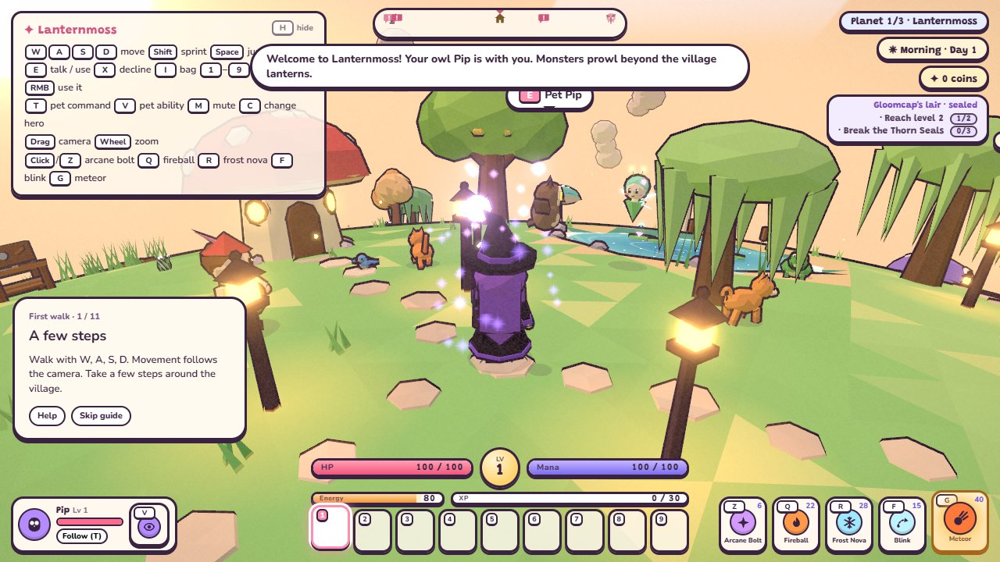
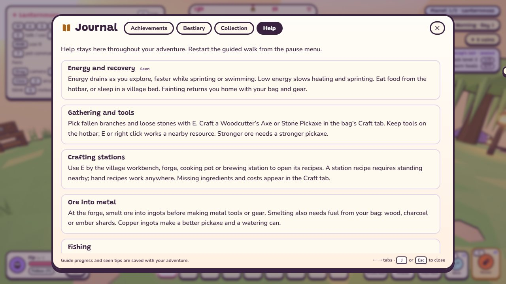
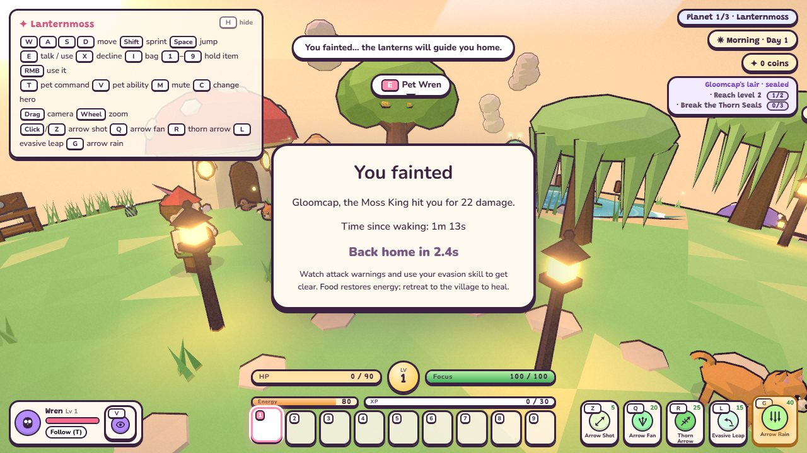

# Tutorial and first-time help

New adventures start a small guide in the lower left. It follows real actions: walking, dragging the camera,
talking to a villager, opening the bag, selecting a different hotbar slot, leaving the safe village, using the hero’s
evasion and basic attack, aiming an ultimate, and defeating an ordinary monster. The last page explains the current
planet’s sealed boss conditions and has a **Got it** button. Actions performed early count when their page is reached.
The guide uses the existing world and gives no rewards, items or extra monsters.

**Skip guide** hides it. **Pause → Restart guided walk** starts it again without resetting the adventure or learned
help topics. The guide hides behind dialogue, the bag, paused menus, interiors, travel and cutscenes. It resumes when
play resumes. Key prompts follow Settings → Keys; evasion and ultimate prompts follow the current hero.

**Journal → Help**, the guide’s **Help** button, or **Pause → Help** opens lasting advice. All topics and first-find
tips remain readable even before they have been encountered. Seen badges, guide progress and skipped/completed
status save with the adventure; starting a new adventure clears them. Existing version 1 saves remain readable and
leave the guide skipped until restarted.

**You fainted** shows the attacker (including the owner of a lingering hazard), the final damage after mitigation,
elapsed simulation time since waking, the remaining automatic respawn countdown and a recovery tip. Paused time
does not count. Saving while fainted keeps the recap and remaining countdown. Unknown sources are named truthfully
as an unknown hazard. Fainting keeps the existing respawn rules, inventory, coins and XP.

Copy and stable IDs live in `src/config/tutorial.js`; `src/gameplay/Tutorial.js` observes game/combat events and owns
the save record. The UI is in `src/ui/TutorialUI.js` and `src/ui/help.js`. Keep these data entries current when TODOs
22/24 change crafting or farming. Step IDs are saved, so keep them stable when editing copy.

Checks: `npm test`, `npm run sim` (includes `tutorial.sim.mjs`), and `node scripts/tutorial-smoke.mjs`. The optional
browser check needs `puppeteer-core` (`npm i --no-save --no-package-lock puppeteer-core`); it defaults to Windows Edge,
or uses the `CHROME` environment variable. It checks clicks, skip/reload/replay, all heroes with rebound prompts,
guide/control overlap, pause/Help bounds at 1280×720 and 1920×1080, and fainting/paused countdown. Screenshots:

