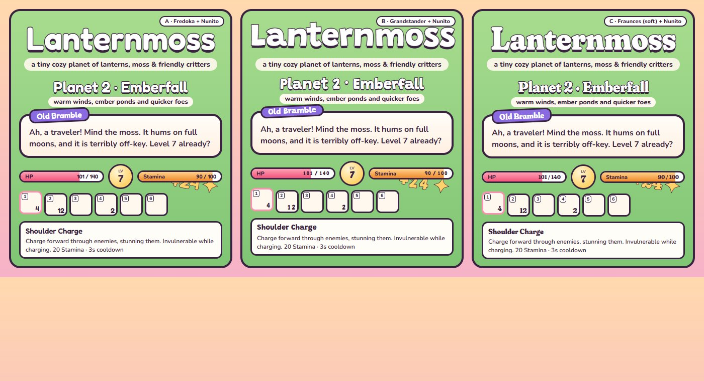

# Lanternmoss typography

## Brief

**What Lanternmoss is:** a cozy, storybook game about tiny round planets lit by lanterns and covered in moss, full of
friendly villagers, critters and pets, with a little magic in everything (glowing mushrooms, wisps, charms, a wizard
whose hat is load-bearing). The art is soft low-poly with thick ink outlines, warm sunset light and candy colours.

**Mood words:** cozy · handmade · warm · playful · a little magical · storybook · friendly but not babyish.

**References:** hand-lettered picture-book covers; the chunky outlined lettering of cozy games (Animal Crossing,
A Short Hike, Ooblets); chalkboard menus at a village bakery.

**What the type has to do:**

- **Display** (the title, planet banners, names, numbers on the HUD, damage and coin pop-ups) must feel *drawn by
  hand* and match the thick-outlined art. It must still read instantly at a glance mid-fight, digits especially.
- **Body** (dialogue, tooltips, item descriptions, menus, small HUD labels) must be calm, round and very readable at
  11–16 px, so it doesn't compete with the display face.

## Candidates

All candidates are free (SIL Open Font License) fonts on Google Fonts. Each was compared on a mock-up of the title,
a planet banner, a dialogue box, the vitals and hotbar, and a tooltip: [type-specimen.html](type-specimen.html)
(rendered: ).

| | Display | Body | Verdict |
|---|---|---|---|
| A | Fredoka | Nunito | Friendly and very legible, but it's the rounded "app" look many games use. Clean rather than handmade, so not ours. |
| **B** | **Grandstander** | **Nunito** | **Hand-lettered, bouncy and warm. It looks drawn, like the ink-outlined art, and its digits stay clear. The most "storybook".** |
| C | Fraunces (soft) | Nunito | Magical, fairy-tale serif and lovely on the title, but too formal for a playful game and busy at HUD sizes. |

Nunito is the body face in all three: rounded terminals that echo the display faces, sturdy at small sizes, and lots
of weights. It replaces M PLUS Rounded 1c, which was a little thin and wide at small sizes.

## Decision: Grandstander + Nunito

- `--font-display: 'Grandstander'`: weights 700–800. Used for the title, planet and quest banners, menu headings,
  villager / item / ability / boss names, the level badge, numbers on bars and hotbar slots, cooldown counts,
  damage and coin pop-ups, and the held item's name.
- `--font-body: 'Nunito'`: weights 600 (text), 800 (labels and buttons), 900 (tiny caps). Used for dialogue, tooltips,
  descriptions, menus, toasts, prompts and key caps.
- Numbers use `font-variant-numeric: tabular-nums` where they tick (bars, cooldowns), so they don't jitter.
- Sizes and weights stay consistent: body 12–16 px at weight 600–800; display 13–19 px on the HUD, 26–34 px on
  banners and headings, and the title as it is.
- The variables live at the top of `styles/main.css`. Changing the pairing means changing the two variables and the font
  link in `index.html`.
